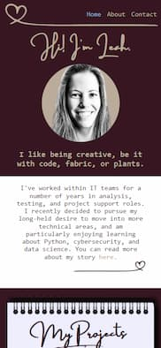
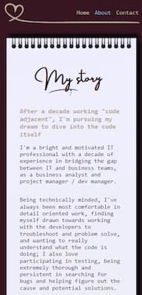

### Leah Taylor portfolio task

[Leah Taylor Portfolio Site](https://ldctaylor.github.io/)

## Project Requirements

### Content

- [x] At least one profile picture
- [x] Biography (at least 100 words)
- [x] Preferred contact method (for bonus points, use a contact form that sends an email to you)
- [x] Section dedicated to listing projects
- [x] Links to external sites, e.g. github and LinkedIn

I'm a Bullet Journal enthusiast and love paper journals. I decided to build my site around the idea of a physical notebook. It has some great CSS effects imitating a notebook with a dog-eared corner, sticky notes, crumpled paper and tape that attaches to items using "::after" and absolute positioning. The projects section is a bunch of sticky notes on a notebook (see screenshots below), which looks cool but I need to figure out how I will display the detail of each project. 

I created the dog-ears by using ::before on items to add an absolutely positioned element with an inset box-shadow in the corner, creating a border-radius on the item, and then using overflow:hidden to clip the part of the box-shadow element that went outside the radius. 

I used some cool linear gradients to create a paper effect:

I also created an "Instax" style frame for photos, so it looks like I've taped photos into my notebook.

If I had the time again, I would approach things differently. I fell down the rabbit hole of spending hours learning to make cool CSS effects for life-like paper using CSS. It was a **lot** of fun, but I then ran out of time to focus on the more important things like, you know, the ***content***. Lesson learnt, and I will be coming back to this project to build out the content more. 

I also need to consider the structure of future content, and the structure of navigation as the site gets bigger. I did not have the time to add a contact form, but I did provide hyperlinks to send me an email. 

### Technical

- [x] At least 2 web pages.
- [x] Version controlled with Git
- [x] Deployed on GitHub pages.
- [x] Implements responsive design principles.
- [x] Uses semantic HTML and accessible design techniques.

My site is two pages, with a "cover page" that includes my projects, and an About page that details my story. 

I spent a lot of time building different views for mobile and tablet/desktop, and then refining them as I tested them using Chrome's development tools. I learnt a lot of techniques around how to write css in a way that is responsive as screen size changes. I used flexbox to ensure my stickynotes are always displayed well on my notebook regardless of device / screen size.

### Bonus (optional)
- [x] Different styles for active, hover and focus states.
- [ ] Include JavaScript to add some dynamic elements to your site
- [ ] functional contact form

I added different styles for hovering over links, including changing the cursor to a pointer. Where there is meant to be a link but there is still no content (e.g. "Contact" in the navigation, and the second project sticky "Coming Soon"), I added a not-allowed cursor, just to demonstrate this technique. For the Coming Soon sticky, I added an ink smudge over the text on the hover state. If I had more time I would have figured out how to make the smudge be on top of the text so it looks actually crossed out. 

When you hover over the sticky notes I wanted it to look like the sticky note is being pressed down onto the paper, with the shadows around the edge moving ( [video here](https://www.loom.com/share/69a1f8e35cb24f709b44f587201f6f08) -external link to Loom).

I ran out of time to look at javascript, but intend to add this after the javascript unit. I also did not create a contact form but will add this in future. 

### Enhancements Log

This are things I would like to add over time:
- [ ] Revise the structure of the site and its content. Consider navigation structure as more content is added.
- [ ] Add a clear site header / site name in the siteheader area!
- [ ] Improve navigation styling - the blue colour isn't very clear against the background
- [ ] Work out how information on projects will be displayed. Sticky note peeling back to reveal the detail on a sticky note underneath? Or something simpler! 
- [ ] Add section for badges, certifications, skills and experience
- [ ] If some information is hidden on initial page display (e.g. the sticky notes peeling to reveal info underneath) it will be important to include a printable view that displays all info
- [ ] Add a functional contact form.
- [ ] Improve the look for wide screens - maybe make the site a max-width for screens over a certain size. The content is too spread out at high resolutions. 
- [ ] Move picture of dog, doesn't really work where it is but I left it to demonstrate the technique of creating an instax frame. 

### Screenshots

#### Mobile view - home page

#### Mobile view - about page

#### Tablet view - home page

#### Tablet view - about page

#### Desktop view - home page

#### Desktop view - about page

